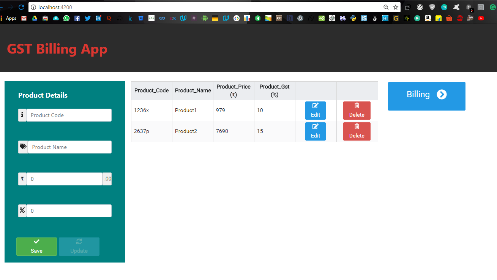
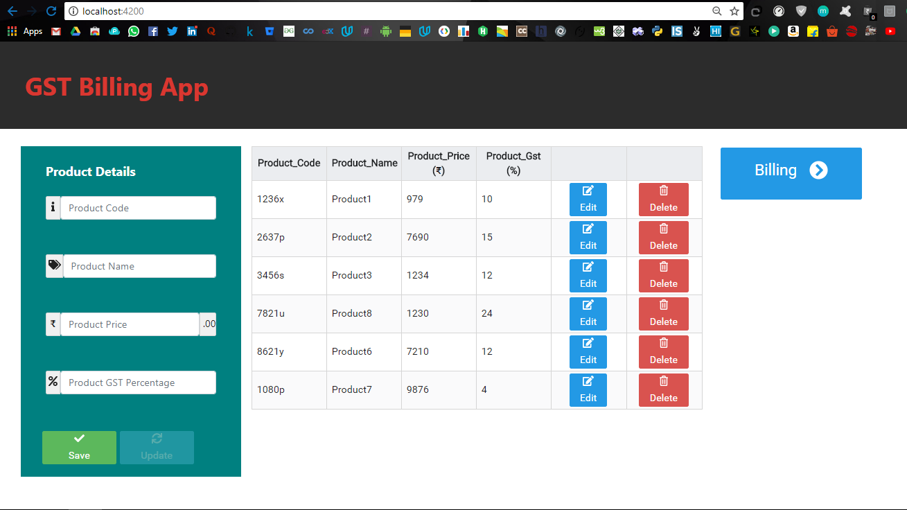
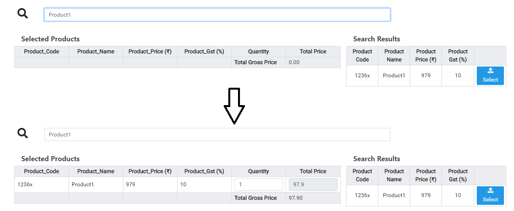
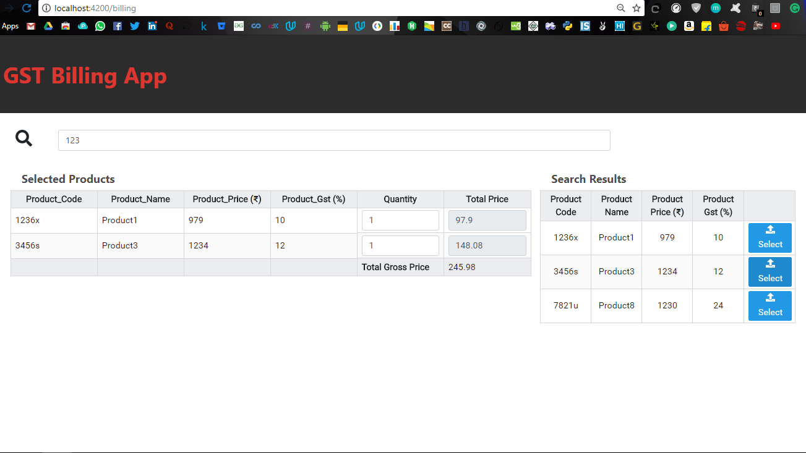
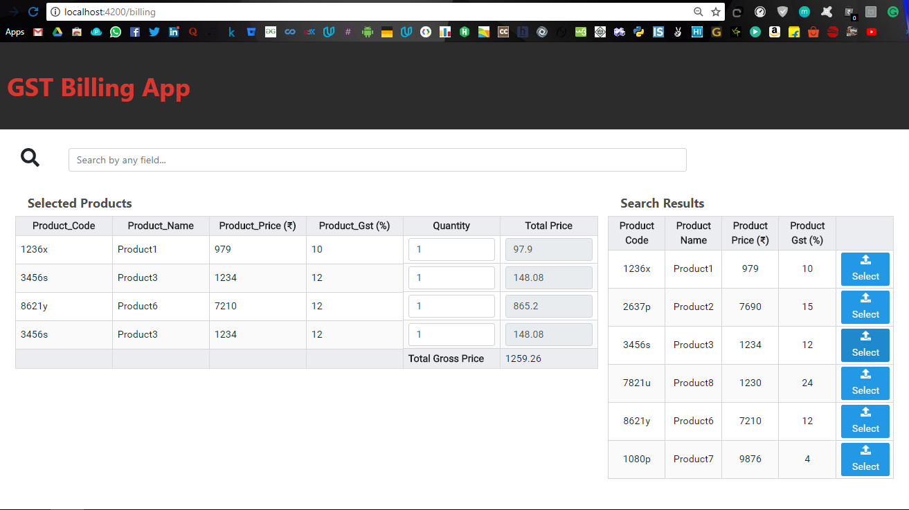
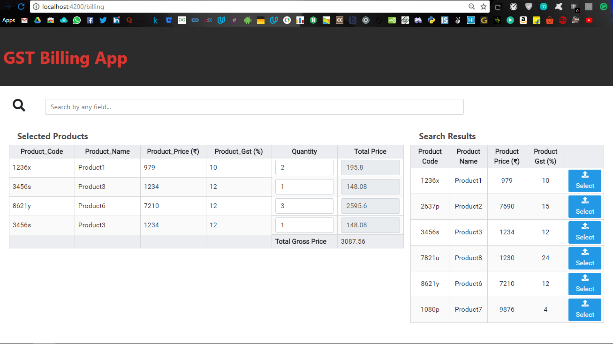

# GST-Billing-App

In this app new product can be added, existing products can be edited in product entry page. Then in billing page all existing products are displayed in a table with search option to search according to any field. After selecting the quantity can be changed and total cost of that product and gross total cost will be updated dynamically.<br>

### Requirements
MySQL Server running with a database name gstbilling and a table name product_details with 5 columns id<PK>, product_code<Unique>, product_name, product_price, product_gst.<br>  

### Steps

1. Clone the repository


    ```
        git clone https://github.com/shushantkumar/ps-drive-2018-gst-app.git
    ```
2. To start the REST API server follow the commands below  
    
    ```
        cd ps-drive-2018-gst-app/GST_REST_API
        npm install
        npm start
    ```       
   and backend server will be running on http://localhost:8000 

3. To run frontend Application 

    ```
        cd ps-drive-2018-gst-app/GST_frontend/gstapp/
        npm install
        ng serve
    ``` 
   and open http://localhost:4200 in your browser to access the Web Application  
<br>
<br>

### Working Details
<br>
* The Product Entry page appears as below <br><br>

<br>
<br>

* There is a form to fill Product details on the left and a table showing existing products in the database.As a new product is filled the table gets updated with new product entry.
Initially the Update button is disabled. <br><br>

<br><br>
* Any Product details can be updated except the product code by clicking on Edit button in the table. Once the button is clicked the details of that product is set in the form with Product Code field disabled and Save button disabled.<br>
Like here I made changes in Product4 with product code 7821u and change its fields from Product4 => Product8 , 1239 => 1230 , 5 => 24 <br><br>

<br><br>
* Then on clicking Update button the fields get updated and changes are displayed in table <br><br>

<br><br>
* Product can even be deleted from database by clicking delete button in the table. Here I deleted Product5<br><br>

<br><br>
* Clicking on Billing button takes us to the billing page where all the entered products in previous page are displayed in a table on the right under Search Results tag.<br><br>

<br><br>
* User can search any product using any of their field and searched results are displayed under the Search Results table. Now user can click on Select button to add the product to final list. On clicking Select, the product gets added to the Selected Products table with default quantity 1 and the total GST price of product is displayed in the row and gross total GST price is displayed at the footer. Making any changes to quantity dynamically changes the Total Price and Total Gross Price  <br><br>

<br><br>
* Similarly by searching for any keyword shortlisted words are displayed on the Search results table and select button can be used to select the product for Billing<br><br>

<br><br>
* So we add some more products...<br><br>

<br><br>
And finally making any changes to the quantity of any product dynamically changes the Total Price and Total Gross Price as depicted below<br>
<br><br>


